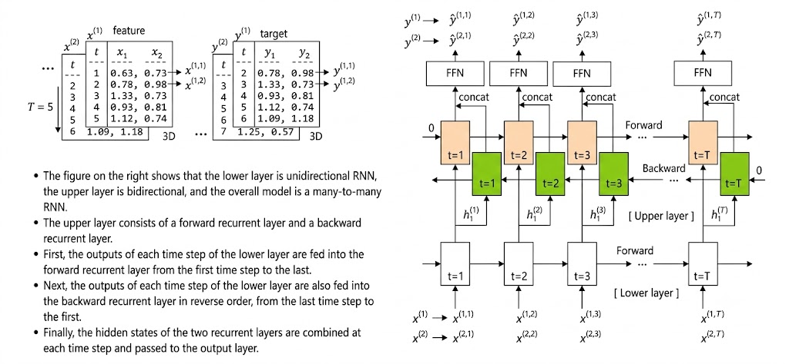
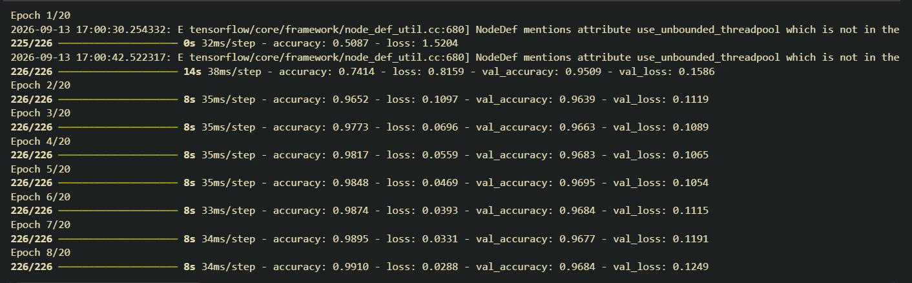
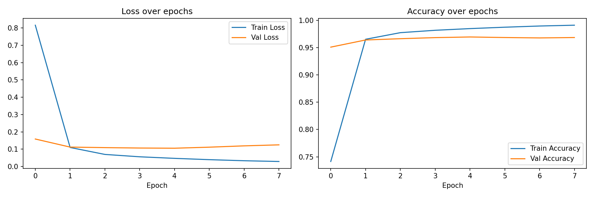

# POS Tagging with Bidirectional LSTM

A part-of-speech (POS) tagging model built with a Bidirectional LSTM in TensorFlow/Keras, trained on ~72,000 tagged sentences from NLTK's Treebank, Brown, and CoNLL-2000 corpora using the Universal POS tagset.

## Overview

Given a sentence, the model predicts a POS tag (NOUN, VERB, ADJ, etc.) for every word — including correctly disambiguating words that can serve different grammatical roles depending on context (e.g. "book" as a NOUN vs. a VERB).

## Architecture



```
Input → Embedding (mask_zero=True) → Bidirectional LSTM → Dense (softmax)
```

The Bidirectional LSTM reads each sentence in both directions, allowing the model to use context from both preceding and following words when predicting a word's tag.

## Dataset

- **Source**: NLTK's Treebank, Brown, and CoNLL-2000 corpora
- **Size**: ~72,000 tagged sentences
- **Tagset**: Universal POS tagset (12 categories: NOUN, VERB, ADJ, ADV, PRON, DET, ADP, NUM, CONJ, PRT, `.`, X)
- **Split**: 80% train / 10% validation / 10% test

## Training



- Loss: `categorical_crossentropy`
- Optimizer: Adam
- Callbacks: `EarlyStopping` (patience=3, restores best weights) and `ModelCheckpoint` (saves best model by validation loss)



## Results

Final test accuracy: 0.9682 

### Example predictions — disambiguating words by context

```
"I read a good book ."          → book = NOUN
"Please book a table for two ." → book = VERB

"This bag is very light ."      → light = ADJ
"He will light the candle ."    → light = VERB

"I have a present for you ."    → present = NOUN
"They will present the results ." → present = VERB
"All students are present today ." → present = ADJ
```

The model correctly assigns different tags to the same word depending on its role in the sentence.

## Setup

```bash
pip install -r requirement.txt
```

## Usage

Open `script.ipynb` and run all cells to reproduce the training pipeline, or load the pretrained model directly:

```python
from tensorflow import keras
model = keras.models.load_model('best_model.keras')
```

Note: the `TextVectorization` layers (`sentence_tokenizer`, `tag_tokenizer`) used to preprocess text must be rebuilt by running the corresponding cells in `script.ipynb`, since their vocabularies are not bundled inside `best_model.keras`.

## Project Structure

```
Pos_Tagging_Bi-LSTM/
├── README.md
├── requirement.txt
├── script.ipynb
├── best_model.keras
└── images/
    ├── Bi-LSTM.jpg
    ├── plot.png
    └── train_history.jpg
```
